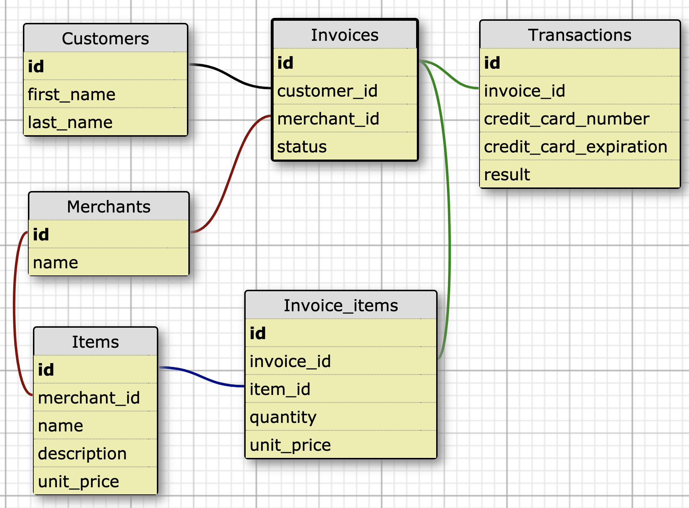
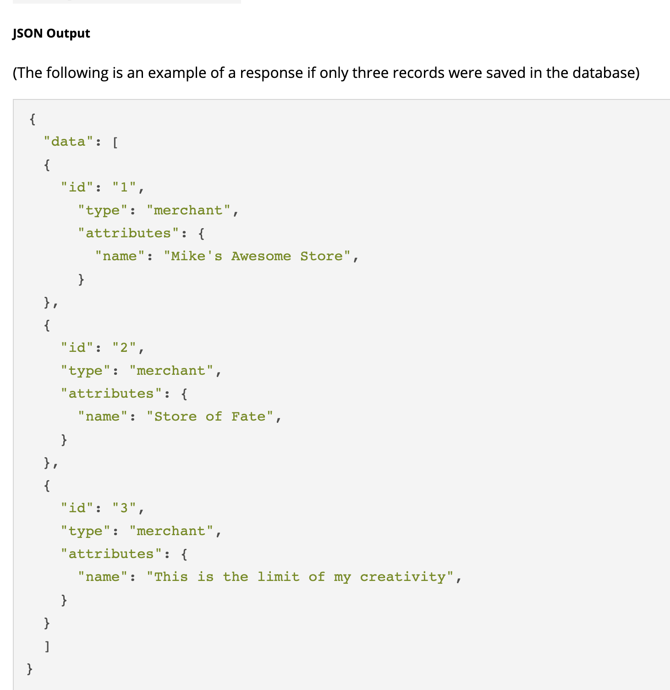

# Sales Engine

This is a solo student project from Turing School of Software & Design as part of the Module 3 backend engineering curriculum.  The purpose of this project was to take CSV file data from an ecommerce site and use Rails and ActiveRecord to build a JSON API which exposes the data schema.
View the original assignment [here](http://backend.turing.io/module3/projects/rails_engine)

## Learning Goals
* Learn how to to build Single-Responsibility controllers to provide a well-designed and versioned API.
* Learn how to use controller tests to drive your design.
* Use Ruby and ActiveRecord to perform more complicated business intelligence.
* API will be compliant to the JSON API spec. [Documentation](https://jsonapi.org/)

## Built With

* [Rails 5.1.7](https://rubyonrails.org/) - Web Framework
* [PostgreSQL 11.1](https://postgresapp.com/) - Database Management System
* [Fast JSON API](https://github.com/Netflix/fast_jsonapi) - JSON API Serializer for Ruby Objects

### Installing

These instructions will get you a copy of the project up and running on your local machine for development and testing purposes.

- From your terminal, clone the repo: ```git clone git@github.com:milevy1/sales_engine.git```
- If you do not have PostgreSQL, follow the steps to setup PostgreSQL [here](https://postgresapp.com/)
- Move to the new project directory: ```cd sales_engine```
- Install required gems by running: ```bundle install```
- Setup the database by running: ```rake db:{create,migrate}```
- Seed the database with CSV data by running: ```rails import:prospect```

### Testing

RSpec was used for testing.  Test coverage was tracked with SimpleCov.

- To run tests, from the root directory, run: ```rspec```

### Database Schema


### Sample JSON Output

